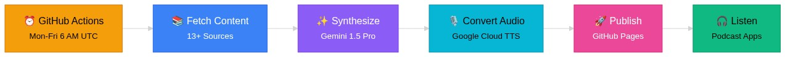

# Personal Podcast Automation

Automated daily audio briefing on your configured topics, synthesized with Gemini 2.5 Pro and delivered as a podcast RSS feed via GitHub Pages.

Wake up to a personalized 8–15 minute episode in your podcast app every weekday morning.

## How It Works



**Key Metrics:**
- ⚡ **Pipeline Runtime:** ~4 minutes
- 💰 **Cost per Episode:** ~$0.25 (Gemini Pro + TTS)
- 📅 **Annual Cost:** ~$90 (250 weekday episodes)
- 🎵 **Episode Length:** 8–15 minutes
- 📰 **Stories Processed:** 20–40 items daily

<details>
<summary><b>📐 View Full Architecture Diagram</b></summary>

<br/>


**Pipeline Steps:**

1. **Fetch Content** — Parallel fetching across all enabled topic modules (AI/tech news, sports teams, real estate feeds, newsletters, international affairs, general news)
2. **Episode Memory & Articles** — Load cross-episode context and curated articles with deduplication
3. **Synthesize Script** — Gemini 2.5 Pro generates a 1,200–2,000 word conversational script including local weather
4. **Convert to Audio** — Google Cloud TTS with Studio voices and automatic sentence-based chunking
5. **Publish & Track** — Commit MP3 + RSS feed to GitHub Pages, update episode memory, track TTS usage and costs

</details>

## Features

- **Automated Daily Pipeline** — Runs Monday–Friday on a configurable schedule via GitHub Actions
- **Config-Driven Content** — All topics, sources, sports teams, real estate markets, and location defined in `configs/your-podcast-id.json`
- **AI-Powered Script** — Gemini 2.5 Pro writes a conversational 8–15 minute script with local weather and multi-episode continuity
- **High-Quality Audio** — Google Cloud Text-to-Speech with Studio voices, automatic chunking for long scripts
- **Podcast RSS Feed** — Published to GitHub Pages with iTunes tags, artwork, and owner email for Spotify submission
- **Zero Infrastructure** — Completely free hosting via GitHub Pages + Actions
- **Multi-Podcast Support** — Run multiple podcasts from the same codebase via separate config files

## Prerequisites

1. **Google API Key** — Get from https://aistudio.google.com/ (required for Gemini and weather)
2. **Google Cloud Project** with:
   - Text-to-Speech API enabled
   - Service Account with JSON key
3. **GitHub Personal Access Token** (for local testing) — Create with `repo` scope
4. **Twitter/X API Bearer Token** (optional) — Free Basic tier from developer.twitter.com
5. **Anthropic API Key** (optional) — Legacy support for Claude synthesis

## Quick Start

### 1. Clone and Install

```bash
git clone https://github.com/YOUR_USERNAME/YOUR_REPO.git
cd daily-podcast
npm install
```

### 2. Configure Your Podcast

Create a config file at `configs/your-podcast-id.json`. See existing configs in `configs/` for the full schema. Key fields:

```json
{
  "id": "your-podcast-id",
  "metadata": {
    "title": "Your Podcast Title",
    "author": "Your Name",
    "description": "A short description of your podcast"
  },
  "location": {
    "city": "Your City",
    "timezone": "America/Chicago"
  },
  "content": {
    "aiNews": { "enabled": true },
    "sports": { "enabled": true, "teams": [] },
    "realEstate": { "enabled": true, "targetMarkets": [] },
    "news": { "enabled": true, "feeds": [] }
  }
}
```

### 3. Configure Environment

Create `.env`:

```bash
GOOGLE_API_KEY=your-gemini-api-key
GOOGLE_APPLICATION_CREDENTIALS=./service-account.json
TWITTER_BEARER_TOKEN=your-twitter-token        # Optional
GITHUB_TOKEN=ghp_your-personal-token-here      # For local testing
GITHUB_REPOSITORY=YOUR_USERNAME/YOUR_REPO
PAGES_BASE_URL=https://YOUR_USERNAME.github.io/YOUR_REPO
PODCAST_TITLE="Your Podcast Title"
PODCAST_AUTHOR=Your Name
```

### 4. Set Up Google Cloud

1. Go to [Google Cloud Console](https://console.cloud.google.com/)
2. Create a new project
3. Enable **Cloud Text-to-Speech API**
4. Create Service Account:
   - IAM & Admin → Service Accounts → Create
   - Grant role: "Service Account User"
   - Create JSON key → Save as `service-account.json`

### 5. Set Up GitHub Pages

```bash
# Create and push an empty gh-pages branch
git checkout --orphan gh-pages
git rm -rf .
mkdir episodes
echo "<h1>$PODCAST_TITLE</h1>" > index.html
git add .
git commit -m "Initialize gh-pages"
git push origin gh-pages
git checkout main
```

Then in GitHub: **Settings → Pages → Source → Deploy from branch → gh-pages → / (root)**

### 6. Add Podcast Artwork

Artwork is configured per-podcast in your config file:

```json
"paths": {
  "artworkFile": "your-podcast-id-artwork.jpg"
}
```

**Requirements:**
- Size: 1400×1400 to 3000×3000 pixels (square)
- Format: JPG or PNG
- File size: Under 500 KB
- Location: Root of `gh-pages` branch

Each podcast has its own artwork file hosted on `gh-pages`. To update, commit the new file directly to `gh-pages`.

### 7. Run Locally

```bash
node src/index.js
```

Verify output at: `https://YOUR_USERNAME.github.io/YOUR_REPO/feed.xml`

## GitHub Actions Setup

### Secrets

Go to: Settings → Secrets and variables → Actions → New repository secret

| Secret | Value |
|---|---|
| `GOOGLE_API_KEY` | Google AI Studio API key |
| `GCP_SERVICE_ACCOUNT_JSON` | Full contents of `service-account.json` |
| `TWITTER_BEARER_TOKEN` | Twitter/X API Bearer Token (optional) |
| `PODCAST_AUTHOR` | Your name |

### Variables

Go to: Settings → Secrets and variables → Actions → Variables tab

| Variable | Value |
|---|---|
| `PAGES_BASE_URL` | `https://YOUR_USERNAME.github.io/YOUR_REPO` |
| `PODCAST_TITLE` | Your podcast title |

### Schedule

The workflow runs automatically:
- **Time**: Configurable via cron in `.github/workflows/daily-briefing.yml`
- **Days**: Monday–Friday by default
- **Manual**: Actions tab → "Run workflow"

## Subscribe

Add your RSS feed to any podcast app:

```
https://YOUR_USERNAME.github.io/YOUR_REPO/feed.xml
```

Tested apps: Pocket Casts, Overcast, Apple Podcasts, Castro — all support adding a custom RSS URL.

Enable **auto-download** so episodes are ready when you wake up.

> **Spotify**: Requires manual submission at [podcasters.spotify.com](https://podcasters.spotify.com). The RSS feed includes required iTunes tags and owner email.

## Project Structure

```
daily-podcast/
├── .github/workflows/
│   └── daily-briefing.yml      # GitHub Actions workflow
├── configs/
│   └── your-podcast-id.json    # Podcast configuration
├── src/
│   ├── index.js                # Main orchestrator
│   ├── fetcher.js              # Content fetching + Gemini Flash summarization
│   ├── synthesizer.js          # Gemini 2.5 Pro script generation + weather
│   ├── tts.js                  # Google TTS with chunking
│   ├── publisher.js            # RSS 2.0 + iTunes feed builder
│   ├── episodeMemory.js        # Cross-episode continuity
│   └── githubCommitter.js      # GitHub API commits to gh-pages
├── .env                        # Local config (gitignored)
├── service-account.json        # GCP credentials (gitignored)
├── package.json
└── README.md
```

## Pipeline Details

1. **Fetch** (parallel) — All enabled content modules run concurrently:
   - AI/tech news from configured sources
   - Sports teams via ESPN API + fan site RSS feeds
   - Real estate from configured research feeds
   - International affairs from configured RSS sources
   - Newsletters via Kill the Newsletter
   - General news from configured RSS feeds
   - Local weather from Open-Meteo API (coordinates from config)

2. **Summarize** — Specialized modules (sports, real estate) are pre-summarized with **Gemini 2.5 Flash** before script generation

3. **Synthesize** — All content + weather + **Episode Memory** sent to **Gemini 2.5 Pro**, which writes a 1,200–2,000 word conversational script with natural host/cohost banter and cross-episode continuity (7-day context window)

4. **Convert to Audio** — Google Cloud TTS (Studio voices), automatic chunking at 5,000-byte limit with sentence-based splitting for natural flow

5. **Publish** — MP3 committed to `gh-pages/episodes/`, RSS feed and episode memory updated

## Cost Estimate

| Service | Usage | Cost/day |
|---|---|---|
| Gemini 2.5 Pro (script) | ~20,000 input + 2,000 output tokens | ~$0.04 |
| Gemini 2.5 Flash (summaries) | ~5,000 tokens | ~$0.005 |
| Google TTS (Studio) | ~12,000 characters (10–15 min) | ~$0.20 |
| GitHub Actions / Pages | Daily runtime + hosting | Free |
| **Total** | | **~$0.25/day (~$90/year)** |

## Customization

| What to change | Where |
|---|---|
| Topics, sources, sports teams, markets | `configs/your-podcast-id.json` |
| Location and weather coordinates | `config.location` in your podcast config |
| Host personalities and script style | `src/synthesizer.js` |
| Publish schedule | `.github/workflows/daily-briefing.yml` |

## Troubleshooting

- GCP credentials and service account setup → `docs/`
- GitHub Actions permissions → workflow file comments
- TTS chunking limits → `src/tts.js`

## License

MIT
